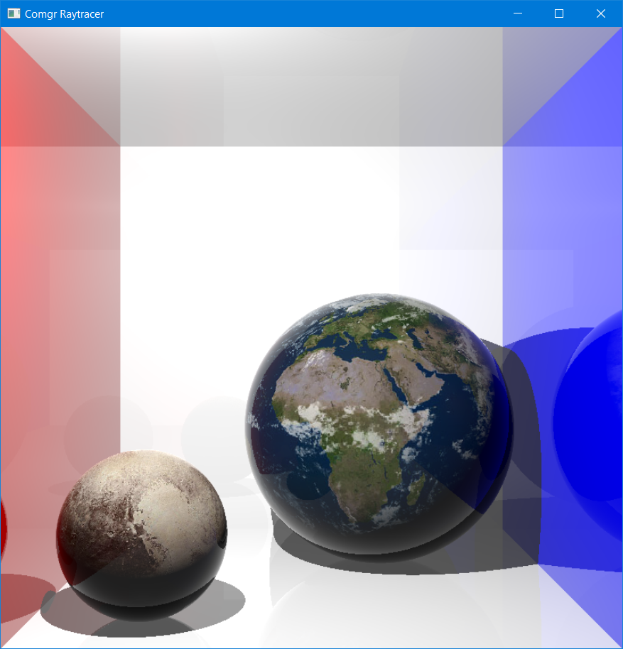
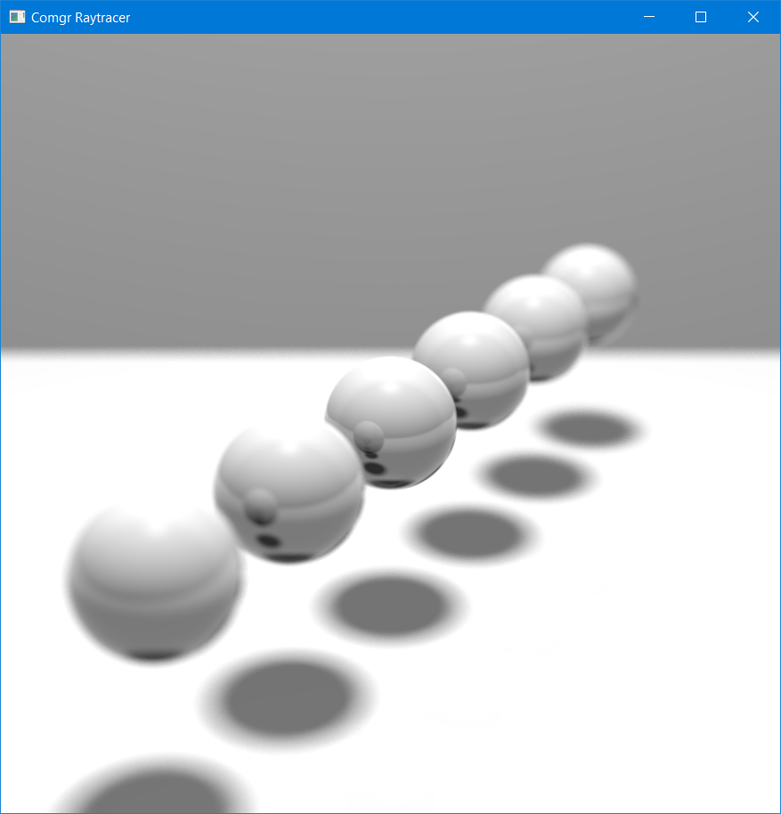
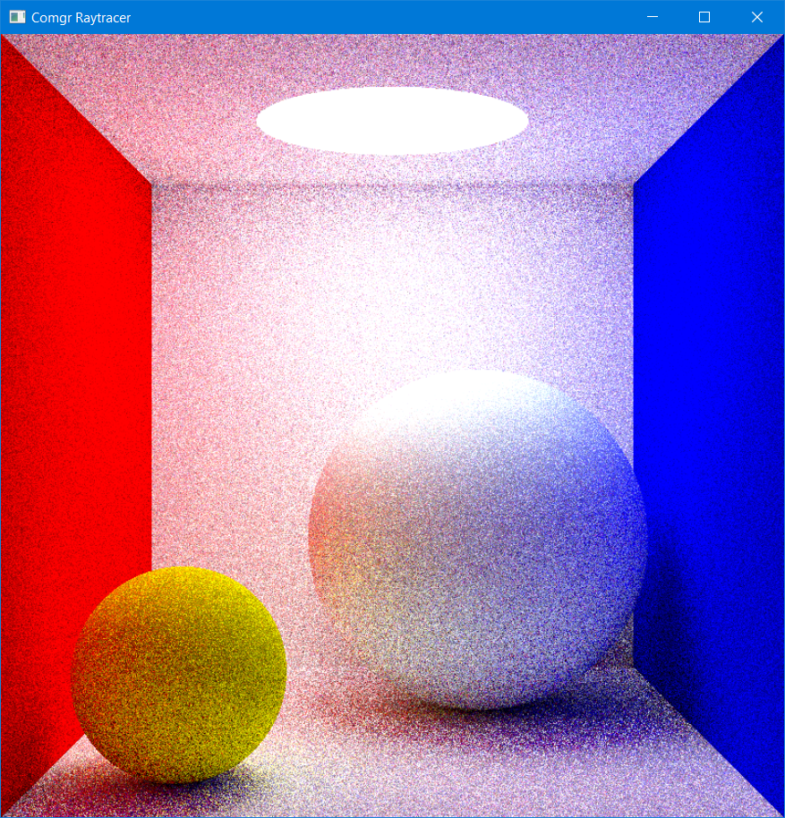

# comgr-raytracer
A raytracer I built as an exercise for my computer graphics (comgr) class at the [University of Applied Sciences and Arts Northwestern Switzerland](https://www.fhnw.ch/en/).

## Sample Images
These sample images were made from the premade scenes `Lab04Textures`, `DepthOfField` and `Lab06`.

### Cornell Box with Textured Spheres

### Spheres with Depth of Field

### Cornell Box with Global Illumination
